# Crear un REST API para un carrito de compras. Este API debe tener los siguientes servicios:

#### Author: Edy Felix Tarqui Guarachi

[](https://heroku.com/deploy)

Extensible REST API server with CRUD methods. Intended to integrate various data models through a common API. Built with [Express](https://expressjs.com/) in [Node.js](https://nodejs.org/en/).

Currently, the app has examples of a CRUD interface for:

- [x] JavaScript memory (for initial development)
- [x] MongoDB (with Mongoose schemas)
- [ ] Sequelize

### Links and Resources

- [JSdoc API Documentation][jsdoc]
- [Swagger Documentation][swagger]

## Endpoints 


### Products (Productos) Todas autenticadas

See links for examples of each method.

| Route                                          | API V1 Middleware          | HTTP Method | CRUD Operation | Status Code                                 |
| ---------------------------------------------- | -------------------------- | ----------- | -------------- | ------------------------------------------- |
| [`/api/v1/products`, `/api/v1/products/:id`](#GET) | getAllProducts, getProductById | `GET`       | Read           | 200 (OK), 404 (Not Found)                   |
| [`/api/v1/products`](#POST)                  | addProduct                 | `POST`      | Create         | 200 (OK), 404 (Not Found)                   |
| [`/api/v1/products/:id`](#PUT)                   | updateProduct                  | `PUT`       | Update         | 200 (OK), 204 (No Content), 404 (Not Found) |
| [`/api/v1/products/:id`](#DELETE)                | deleteProduct               | `DELETE`    | Delete         | 200 (OK), 404 (Not Found)                   |

### Users (Usuarios)Todas autenticadas

See links for examples of each method.

| Route                                          | API V1 Middleware          | HTTP Method | CRUD Operation | Status Code                                 |
| ---------------------------------------------- | -------------------------- | ----------- | -------------- | ------------------------------------------- |
| [`/api/v1/users`, `/api/v1/users/:id`](#GET) | getAllusers, getUserById | `GET`       | Read           | 200 (OK), 404 (Not Found)                   |
| [`/api/v1/users`](#POST)                  | addUser                 | `POST`      | Create         | 200 (OK), 404 (Not Found)                   |
| [`/api/v1/users/:id`](#PUT)                   | updateUser                  | `PUT`       | Update         | 200 (OK), 204 (No Content), 404 (Not Found) |
| [`/api/v1/users/:id`](#DELETE)                | deleteUser               | `DELETE`    | Delete         | 200 (OK), 404 (Not Found)                   |

### Routes : Auth (Autenticacion) Sin autenticacion

See links for examples of each method.

| Route                                          | API V1 Middleware          | HTTP Method | CRUD Operation | Status Code                                 |
| ---------------------------------------------- | -------------------------- | ----------- | -------------- | ------------------------------------------- |
| [`/api/v1/auth/login`](#GET) | login (Autentica usuario y devuelve JWT)| `GET`       | Read           | 200 (OK), 404 (Not Found)                   |

### Shopping Cart (Carrito de compras) Todas autenticadas

| Route                                          | API V1 Middleware          | HTTP Method | CRUD Operation | Status Code                                 |
| ---------------------------------------------- | -------------------------- | ----------- | -------------- | ------------------------------------------- |
| [`/api/v1/cart/product`](#POST)                  | addProductToShoppingCart      (Si existe un shopping cart que este en estado PENDING anadir el producto a ese carrito, si no creamos el carrito de compras y anadimos el primer producto)                 | `POST`      | Create         | 200 (OK), 404 (Not Found)                   |
| [`/api/v1/cart/product/:id`](#DELETE)                | deleteShoppingCart  (Si existe un shopping cart que este en estado pending y que tenga ese producto removemos el producto de ese carrito, sino damos error)             | `DELETE`    | Delete         | 200 (OK), 404 (Error)                   |
| [`/api/v1/cart/pay`](#POST)                   | payShoppingCart  (Paga el carrito que este en estado pendiente con minimo un producto en el. Si no existe un carrito con estas caracteristicas se dispara un error)                | `PUT`       | Update         | 200 (OK), 204 (No Content), 404 (Error) |


### Installation

Get a local version of this server running with the following steps:

1.  Clone the repository to your machine
2.  Navigate to the repository and install all dependencies (listed in the `package.json`)

    ```
    cd modulo4-practica3

    npm i
    ```

3.  Create a file named `.env` in the repository's root directory and add the following variables:
    - `PORT` - defaults to `3000`
    - `DATABASE` - a standard [connection string](https://docs.mongodb.com/manual/reference/connection-string/) to a running MongoDB instance. Read more about setting up MongoDB on your machine [here](https://docs.mongodb.com/manual/).
    ###### Example:
    ```
    PORT=3030
    DATABASE=mongodb://localhost:27017/fullstack
    JWT_SECRET=my-ultra-secure-and-ultra-long-secret
    JWT_EXPIRES_IN=90d
    JWT_COOKIE_EXPIRES_IN=1
    ```
4.  Run the server and visit `localhost:3030` in your browser to see it running.
    ```
    node path/to/modulo4-practica3
    ```
    Consider using [nodemon](https://www.npmjs.com/package/nodemon) to make development easier.


## Products (Productos) Todas autenticadas

### `POST`

/api/v1/products -- Insertar producto
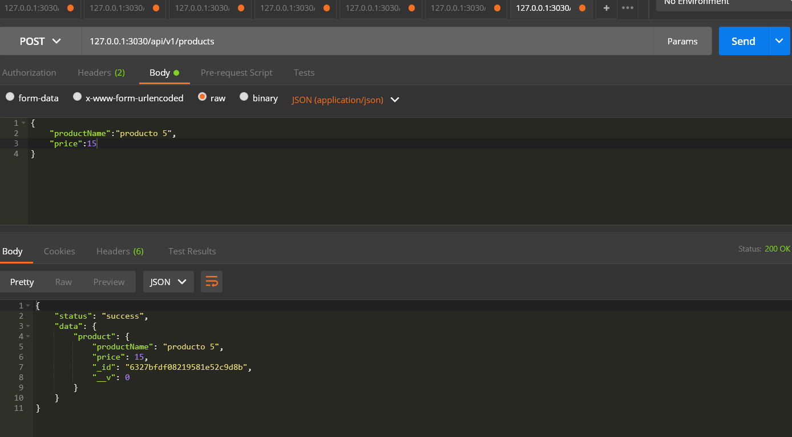


---

### `GET`

/api/v1/products  --Listar todos los productos
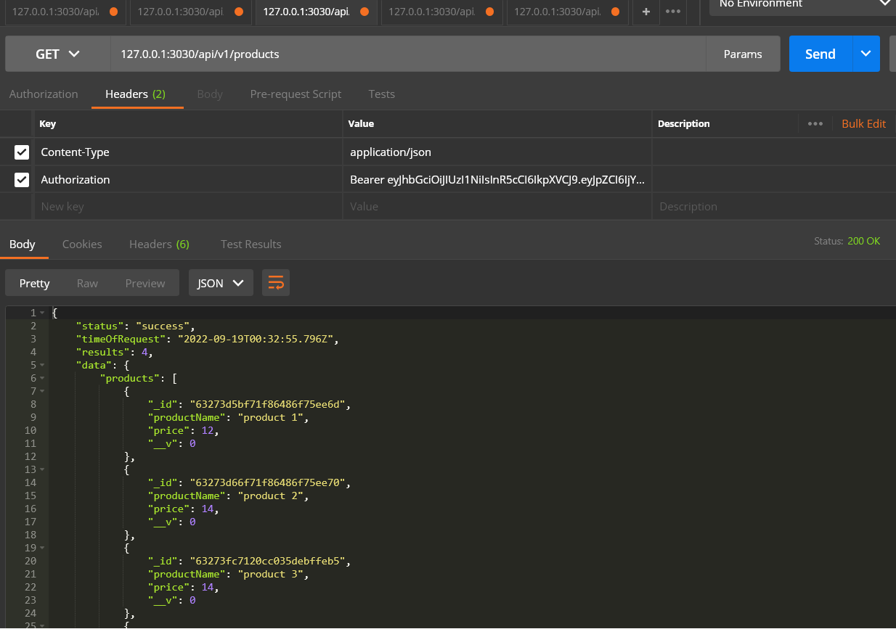
/api/v1/products/:id  --Obtener un producto
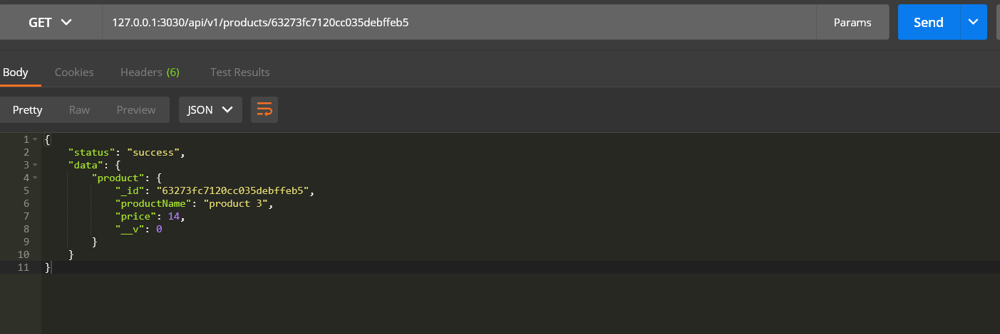
<details>
<summary><strong>Example</strong></summary>

After populating the database with the [example `POST` requests](#post), make the following `GET` request using HTTPie:

```
http :3000/api/v1/products
```

It should output something like the following:

```
{
    "status": "success",
    "timeOfRequest": "2022-09-19T01:19:25.605Z",
    "results": 6,
    "data": {
        "products": [
            {
                "_id": "63273d66f71f86486f75ee70",
                "productName": "product 2",
                "price": 14,
                "__v": 0
            },
            {
                "_id": "63273fc7120cc035debffeb5",
                "productName": "product 3",
                "price": 14,
                "__v": 0
            },
            {
                "_id": "632742ed48b1bb9a07478753",
                "productName": "product 4",
                "price": 15,
                "__v": 0
            },
            {
                "_id": "6327bfdf08219581e52c9d8b",
                "productName": "product 1",
                "price": 15,
                "__v": 0
            },
            {
                "_id": "6327c2485fe45b1132ea253d",
                "productName": "producto 5",
                "price": 15,
                "__v": 0
            },
            {
                "_id": "6327c2515fe45b1132ea2540",
                "productName": "product 6 mod",
                "price": 15,
                "__v": 0
            }
        ]
    }
}
```

<hr/>
</details>

---

### `PUT`

/api/v1/products/:id --Modificar producto

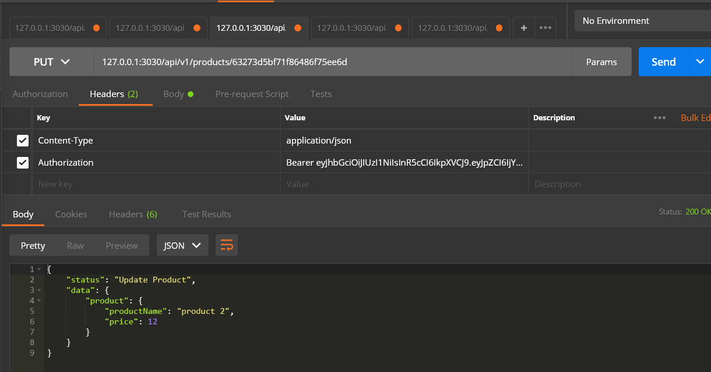

---

### `DELETE`

/api/v1/products/:id -- Eliminar producto

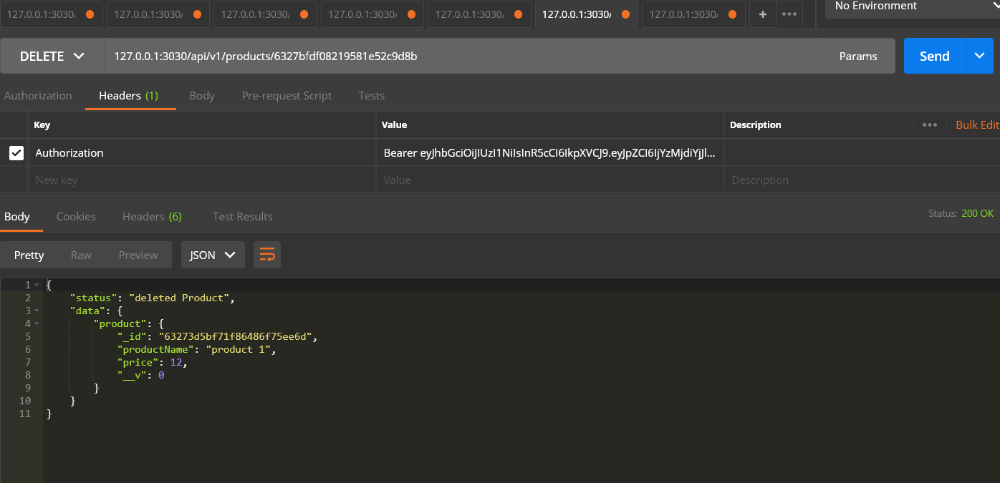
---

## Users (Usuarios)Todas autenticadas

### `POST`

/api/v1/users  -- Crear usuario
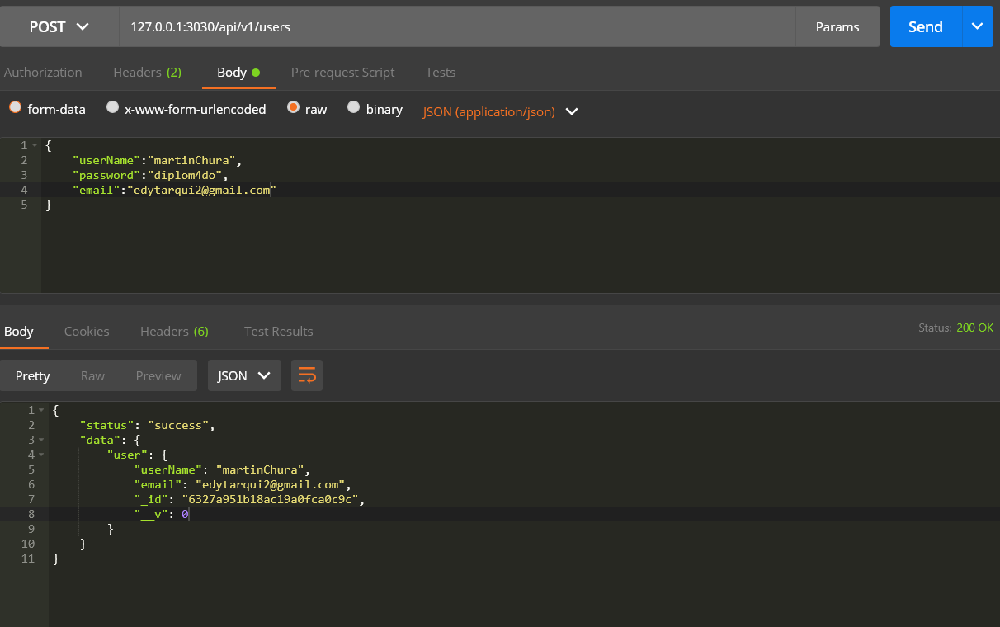


---

### `GET`

/api/v1/users  -- Listar todos los usuarios
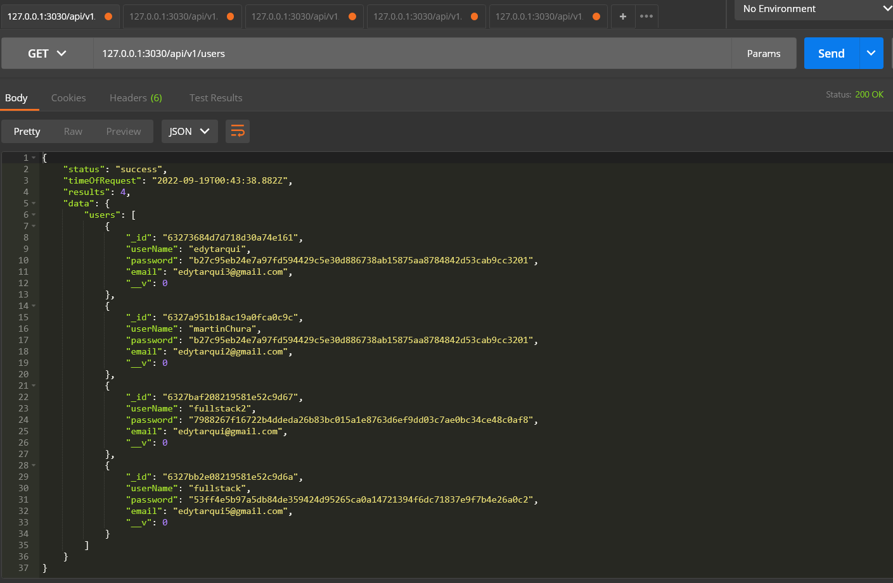
/api/v1/users/:id -- Obtener un usuario
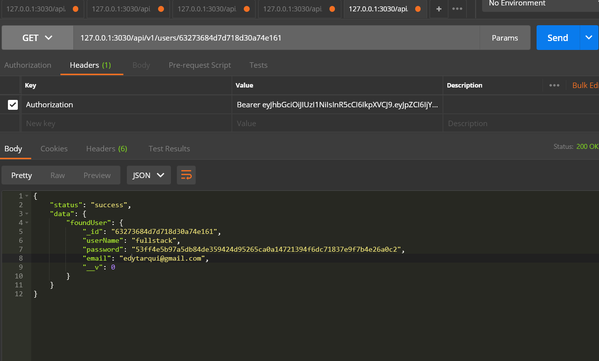

---

### `PUT`

/api/v1/users/:id -- Modificar Usuario

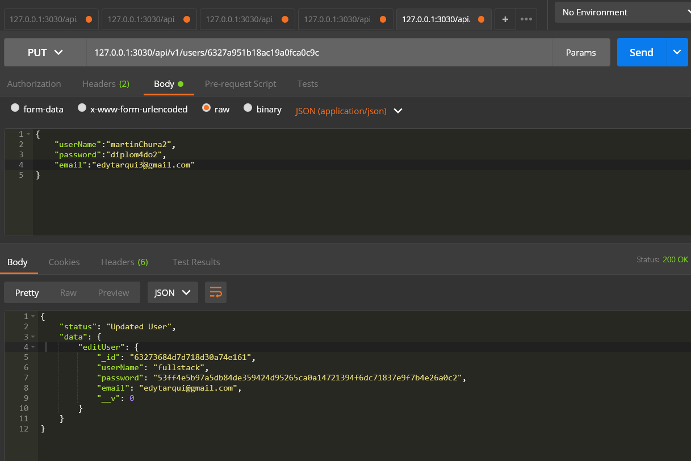

---

### `DELETE`

/api/v1/users/:id -- Eliminar Usuario

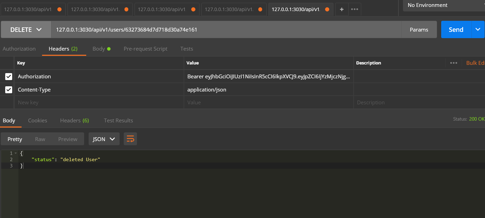
---

## Auth (Autenticacion) Sin autenticacion

### `GET`

/api/v1/auth/login  -- Autentica usuario y devuelve JWT
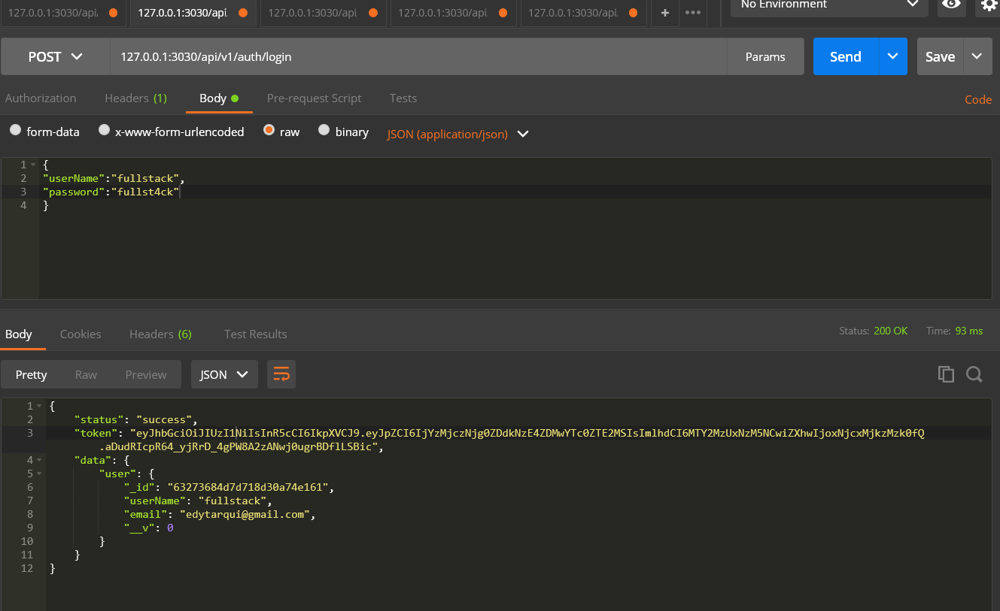

---

## Shopping Cart (Carrito de compras) Todas autenticadas

### `POST`

/api/v1/cart/product  -- Si existe un shopping cart que este en estado PENDING anadir el producto a ese carrito, si no creamos el carrito de compras y anadimos el primer producto
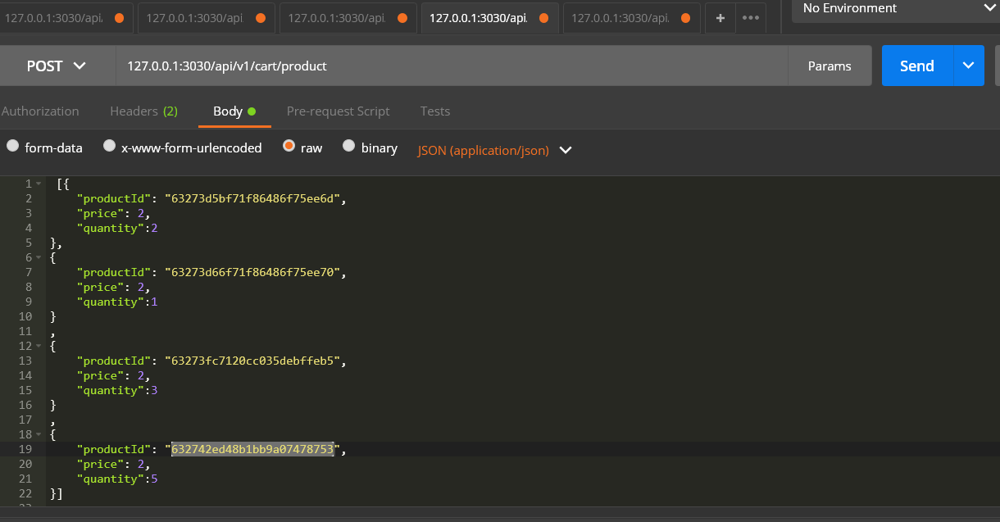


---

### `DELETE`

/api/v1/cart/product/:id --
 Si existe un shopping cart que este en estado pending y que tenga ese producto removemos el producto de ese carrito,
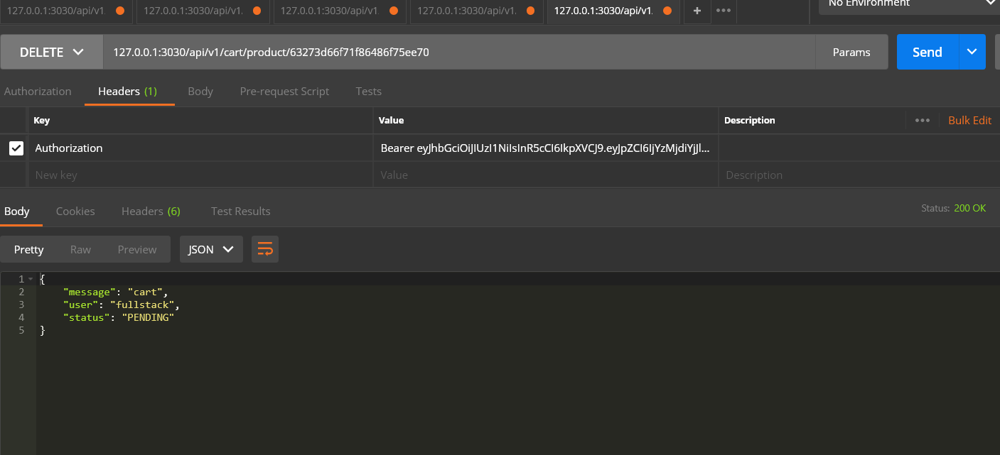

sino damos error

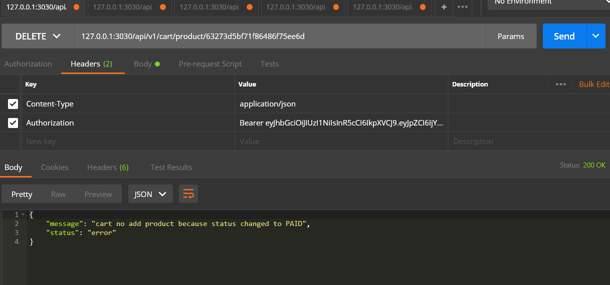
---

### `POST`

/api/v1/cart/pay -- Paga el carrito que este en estado pendiente con minimo un producto en el. Si no existe un carrito 
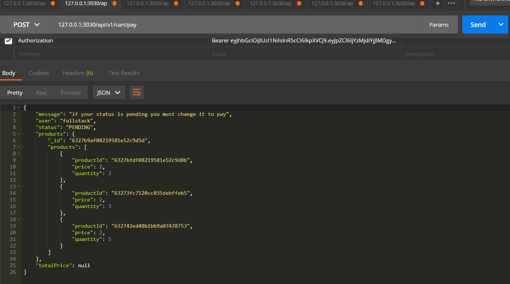
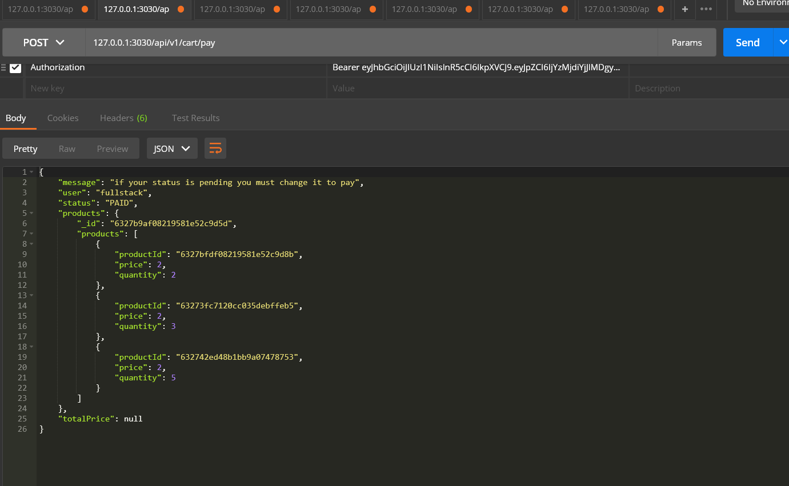

---
El modelo de shoping cart tendra al menos los siguientes atributos:

user: El usuario que realiza la compra
status: PENDING o PAID
products: un array o una tabla con id del producto, precio de venta  y cantidad
